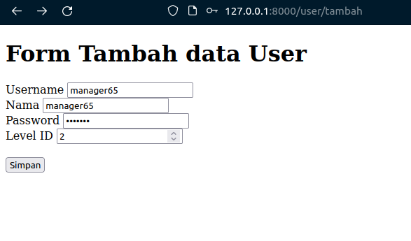
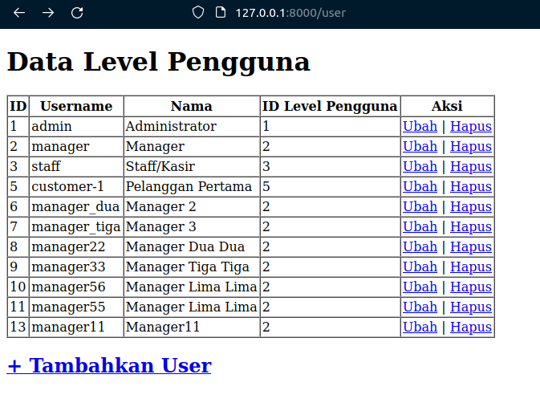

# Jobsheet-4: Eloquent ORM

- **Nama**: Fahmi Yahya
- **NIM**: 2341720089
- **Kelas**: TI-2A


### Praktikum 1 - $fillable:
1. Buka file model dengan nama UserModel.php dan tambahkan $fillable seperti gambar di bawah ini
```php
<?php

namespace App\Models;

use Illuminate\Database\Eloquent\Factories\HasFactory;
use Illuminate\Database\Eloquent\Model;

class User extends Model
{
    use HasFactory;

    protected $table = 'm_user';
    protected $primaryKey = 'user_id';

    protected $fillable = ['level_id', 'username', 'nama', 'password'];
}
```
2. Buka file controller dengan nama UserController.php dan ubah script untuk
menambahkan data baru seperti gambar di bawah ini
```php
<?php

namespace App\Http\Controllers;

use Illuminate\Http\Request;
use App\Models\User;
use Illuminate\Support\Facades\Hash;

class UserController extends Controller
{
    function index() {
        $data = [
            'level_id' => 2,
            'username' => 'manager_dua',
            'nama' => 'Manager 2',
            'password' => Hash::make('12345')
        ];
        User::create($data);

        $user = User::all();
        return view('user', ['data' => $user]);
    }
}
```
3. Simpan kode program Langkah 1 dan 2, dan jalankan perintah web server. Kemudian jalankan link localhostPWL_POS/public/user pada browser dan amati apa yang terjadi<br>
<br>
4. Ubah file model UserModel.php seperti pada gambar di bawah ini pada bagian
$fillable
```php
<?php

namespace App\Models;

use Illuminate\Database\Eloquent\Factories\HasFactory;
use Illuminate\Database\Eloquent\Model;

class User extends Model
{
    use HasFactory;

    protected $table = 'm_user';
    protected $primaryKey = 'user_id';

    protected $fillable = ['level_id', 'username', 'nama'];
}
```

5. Ubah kembali file controller UserController.php seperti pada gambar di bawah hanya bagian array pada $data
```php
<?php

namespace App\Http\Controllers;

use Illuminate\Http\Request;
use App\Models\User;
use Illuminate\Support\Facades\Hash;

class UserController extends Controller
{
    function index() {
        $data = [
            'level_id' => 2,
            'username' => 'manager_tiga',
            'nama' => 'Manager 3',
            'password' => Hash::make('12345')
        ];
        User::create($data);

        $user = User::all();
        return view('user', ['data' => $user]);
    }
}

```
6. Simpan kode program Langkah 4 dan 5. Kemudian jalankan pada browser dan amati apa yang terjadi <br>
<br>
> Setelah dilakukan modifikasi di UserController.php akan membuat error seperti diatas, karena $fillable ‘password’ dihilangkan dan kita melakukan insert data yang memiliki ‘password’ sehingga terjadi error. Perlu ditambahkan $fillable ‘password’ lagi agar bisa menambahkan data. Berikut adalah hasil akhirnya: <br>
<br>
2. $guarded
Kebalikan dari $fillable adalah $guarded. Semua kolom yang kita tambahkan ke $guarded
akan diabaikan oleh Eloquent ketika kita melakukan insert/update. Secara default $guarded
isinya array("*"), yang berarti semua atribut tidak bisa diset melalui mass assignment
(jabarkan istilah ini). <br>
>Mass assignment adalah proses ketika Anda mengatur nilai atribut model menggunakan array asosiatif, seperti saat menggunakan create() atau update() method pada model.

### Praktikum 2.1 – Retrieving Single Models
1. Buka file controller dengan nama UserController.php dan ubah script seperti gambar
di bawah ini
```php
<?php

namespace App\Http\Controllers;

use Illuminate\Http\Request;
use App\Models\User;
use Illuminate\Support\Facades\Hash;

class UserController extends Controller
{
    function index() {
        $user = User::find(1);
        return view('user', ['data' => $user]);
    }
}
```
2. Buka file view dengan nama user.blade.php dan ubah script seperti gambar di bawah ini
```php
<tr>
    <td>{{$data->user_id}}</td>
    <td>{{$data->username}}</td>
    <td>{{$data->nama}}</td>
    <td>{{$data->level_id}}</td>
</tr>
```
3. amati apa yang terjadi dan beri penjelasan
dalam laporan <br>
<br>
>Perbedaannya adalah $user = UserModel::find(1); Akan mencari user dengan ID 1
4. Ubah file controller dengan nama UserController.php dan ubah script seperti gambar
di bawah ini
```php
<?php

namespace App\Http\Controllers;

use Illuminate\Http\Request;
use App\Models\User;
use Illuminate\Support\Facades\Hash;

class UserController extends Controller
{
    function index() {
        $user = User::where('level_id', 1)->first();
        return view('user', ['data' => $user]);
    }
}
```
5. amati apa yang terjadi dan beri penjelasan dalam laporan <br>
<br>
> $user = UserModel::where('level_id',1)->first(); Akan mencari user sesuai kriteria yang ditentukan karena menggunakan where. Setelah itu jika ada beberapa record akan dipilih yang pertama karena menggunakan first.

6. Ubah file controller dengan nama UserController.php dan ubah script seperti gambar
di bawah ini
```php
<?php

namespace App\Http\Controllers;

use Illuminate\Http\Request;
use App\Models\User;
use Illuminate\Support\Facades\Hash;

class UserController extends Controller
{
    function index() {
        $user = User::firstWhere('level_id', 1);
        return view('user', ['data' => $user]);
    }
}
```
7. amati apa yang terjadi dan beri penjelasan dalam laporan<br>
<br>
> $user = UserModel::firstWhere('level_id',1); Mirip dengan cara sebelumnya, bedanya cara ini akan langsung mencari record pertama yang memenuhi kondisi karena menggunakan gabungan first dan Where.
8. Ubah file controller dengan nama UserController.php dan ubah script seperti gambar di bawah ini
```php
<?php

namespace App\Http\Controllers;

use Illuminate\Http\Request;
use App\Models\User;
use Illuminate\Support\Facades\Hash;

class UserController extends Controller
{
    function index()
    {
        $user = User::findOr(1, ['username', 'nama'], function () {
            abort(404);
        });
        return view('user', ['data' => $user]);
    }
}
```
9. amati apa yang terjadi dan beri penjelasan dalam laporan<br>
<br>
>Hanya muncul username dan nama karena kita hanya memberi perintah findOr untuk mencari ‘username’ dan ‘nama’ yang memiliki ID bernilai 1. Jika tidak ditemukan akan memunculkan error kode 404.
10. Ubah file controller dengan nama UserController.php dan ubah script seperti gambar di bawah ini
```php
<?php

namespace App\Http\Controllers;

use Illuminate\Http\Request;
use App\Models\User;
use Illuminate\Support\Facades\Hash;

class UserController extends Controller
{
    function index()
    {
        $user = User::findOr(20, ['username', 'nama'], function () {
            abort(404);
        });
        return view('user', ['data' => $user]);
    }
}
```
11. amati apa yang terjadi dan beri penjelasan dalam laporan <br>
<br>
>Akan menghasilkan error 404 karena data dengan id 20 tidak ditemukan

### Praktikum 2.2 – Not Found Exceptions
1. Ubah file controller dengan nama UserController.php dan ubah script seperti gambar
di bawah ini
```php
<?php

namespace App\Http\Controllers;

use Illuminate\Http\Request;
use App\Models\User;
use Illuminate\Support\Facades\Hash;

class UserController extends Controller
{
    function index()
    {
        $user = User::findOrFail(1);
        return view('user', ['data' => $user]);
    }
}
```
2. amati apa yang
terjadi dan beri penjelasan dalam laporan <br>

>Dijalankan findOrFail(1) yang akan mencari record berdasarkan primary keynya, di kasus ini 1. Jika tidak ditemukan atau fail akan return page 404.
3. Ubah file controller dengan nama UserController.php dan ubah script seperti gambar
di bawah ini
```php
<?php

namespace App\Http\Controllers;

use Illuminate\Http\Request;
use App\Models\User;
use Illuminate\Support\Facades\Hash;

class UserController extends Controller
{
    function index()
    {
        $user = User::where('username', 'manager9')->firstOrFail();
        return view('user', ['data' => $user]);
    }
}
```
4. amati apa yang
terjadi dan beri penjelasan dalam laporan <br>
<br>
>Setelah dijalankan akan menampilkan error 404 karena menggunakan firstOrFail. Metode ini akan mencari record pertama apakah cocok dengan kondisi, jika tidak akan return error. Di kasus ini record pertama bukanlah manager9 sehingga error terjadi.

### Praktikum 2.3 – Retreiving Aggregrates
1.Ubah file controller dengan nama UserController.php dan ubah script seperti gambar di bawah ini
```php
<?php

namespace App\Http\Controllers;

use Illuminate\Http\Request;
use App\Models\User;
use Illuminate\Support\Facades\Hash;

class UserController extends Controller
{
    function index()
    {
        $user = User::where('level_id', '2')->count();
        dd($user);
        return view('user', ['data' => $user]);
    }
}
```
2. Hasil<br>
<br>
>data tampil sesuai  dengan jumlah yg ada di database

### Praktikum 2.4 – Retreiving or Creating Models
1. Ubah file controller dengan nama UserController.php dan ubah script seperti gambar
di bawah ini
```php
<?php

namespace App\Http\Controllers;

use Illuminate\Http\Request;
use App\Models\User;
use Illuminate\Support\Facades\Hash;

class UserController extends Controller
{
    function index()
    {
        $user = User::firstOrCreate([
            'username' => 'manager',
            'nama' => 'Manager',
        ]);
        return view('user', ['data' => $user]);
    }
}
```
2. Ubah kembali file view dengan nama user.blade.php dan ubah script seperti gambar di
bawah ini
```html
<!DOCTYPE html>
<html lang="en">
<head>
    <meta charset="UTF-8">
    <meta name="viewport" content="width=device-width, initial-scale=1.0">
    <meta http-equiv="X-UA-Compatible" content="ie=edge">
    <title>Level</title>
</head>
<body>
    <h1>Data Level Pengguna</h1>
    <table border="1" cellpadding="2" cellspacing="0">
        <tr>
            <th>ID</th>
            <th>Username</th>
            <th>Nama</th>
            <th>ID Level Pengguna</th>
        </tr>
        <tr>
            <td>{{$data->user_id}}</td>
            <td>{{$data->username}}</td>
            <td>{{$data->nama}}</td>
            <td>{{$data->level_id}}</td>
        </tr>
    </table>
</body>
</html>
```
3. amati
apa yang terjadi dan beri penjelasan dalam laporan <br>
<br>
> Tidak ada perubahan pada database karena data sudah ketemu, sehingga tidak perlu create.

4. Ubah file controller dengan nama UserController.php dan ubah script seperti gambar
di bawah ini <br>
```php
<?php

namespace App\Http\Controllers;

use Illuminate\Http\Request;
use App\Models\User;
use Illuminate\Support\Facades\Hash;

class UserController extends Controller
{
    function index()
    {
        $user = User::firstOrCreate([
            'username' => 'manager22',
            'nama' => 'Manager Dua Dua',
            'password' => Hash::make('1234'),
            'level_id' => 2
        ]);
        return view('user', ['data' => $user]);
    }
}
```
5. Simpan kode program Langkah 4. Kemudian jalankan pada browser dan amati apa yang
terjadi dan cek juga pada phpMyAdmin pada tabel m_user serta beri penjelasan dalam
laporan <br>
<br>
<br>
>Akan dibuat record baru dikarenakan find tidak bisa ditemukan

6. Ubah file controller dengan nama UserController.php dan ubah script seperti gambar
di bawah ini
```php
<?php

namespace App\Http\Controllers;

use Illuminate\Http\Request;
use App\Models\User;
use Illuminate\Support\Facades\Hash;

class UserController extends Controller
{
    function index()
    {
        $user = User::firstOrNew([
            'username' => 'manager',
            'nama' => 'Manager',
        ]);
        return view('user', ['data' => $user]);
    }
}
```
7. Simpan kode program Langkah 6. Kemudian jalankan pada browser dan amati apa yang
terjadi dan beri penjelasan dalam laporan <br>
<br>
> Karena data ditemukan maka tidak akan membuat sebuah record dan tidak harus di save()

8. Ubah file controller dengan nama UserController.php dan ubah script seperti gambar
di bawah ini
```php
<?php

namespace App\Http\Controllers;

use Illuminate\Http\Request;
use App\Models\User;
use Illuminate\Support\Facades\Hash;

class UserController extends Controller
{
    function index()
    {
        $user = User::firstOrNew([
            'username' => 'manager33',
            'nama' => 'Manager Tiga Tiga',
            'password' => Hash::make('12345'),
            'level_id' => 2
        ]);
        return view('user', ['data' => $user]);
    }
}
```
9. Simpan kode program Langkah 8. Kemudian jalankan pada browser dan amati apa yang
terjadi dan cek juga pada phpMyAdmin pada tabel m_user serta beri penjelasan dalam
laporan <br>
<br>
<br>
> data akan tampil tetapi tidak disimpan kedalam database
10. Ubah file controller dengan nama UserController.php dan ubah script seperti gambar
di bawah ini
```php
<?php

namespace App\Http\Controllers;

use Illuminate\Http\Request;
use App\Models\User;
use Illuminate\Support\Facades\Hash;

class UserController extends Controller
{
    function index()
    {
        $user = User::firstOrNew([
            'username' => 'manager33',
            'nama' => 'Manager Tiga Tiga',
            'password' => Hash::make('12345'),
            'level_id' => 2
        ]);
        $user->save();

        return view('user', ['data' => $user]);
    }
}
```
11. Simpan kode program Langkah 9. Kemudian jalankan pada browser dan amati apa yang
terjadi dan cek juga pada phpMyAdmin pada tabel m_user serta beri penjelasan dalam
laporan <br>
<br>
<br>
> Hasil seperti diatas, terdapat ID dan ada record baru di database. Dikarenakan fungsi save() digunakan untuk membuat record baru.

### Praktikum 2.5 – Attribute Changes
1. Ubah file controller dengan nama UserController.php dan ubah script seperti gambar
di bawah ini
```php
<?php

namespace App\Http\Controllers;

use Illuminate\Http\Request;
use App\Models\User;
use Illuminate\Support\Facades\Hash;

class UserController extends Controller
{
    function index()
    {
        $user = User::create([
            'username' => 'manager55',
            'nama' => 'Manager Lima Lima',
            'password' => Hash::make('12345'),
            'level_id' => 2
        ]);
        $user->username = 'manager56';

        $user->isDirty();
        $user->isDirty('username');
        $user->isDirty('nama');
        $user->isDirty(['nama', 'username']);

        $user->isClean();
        $user->isClean('username');
        $user->isClean('nama');
        $user->isClean(['nama', 'username']);

        $user->save();

        $user->isDirty();
        $user->isClean();

        dd($user->isDirty());
        return view('user', ['data' => $user]);
    }
}
```
2. Simpan kode program Langkah 1. Kemudian jalankan pada browser dan amati apa yang
terjadi dan beri penjelasan dalam laporan <br>
<br>
>Pada hasil run diatas, dilakukan penambahan data dan hasilnya berhasil sehingga bisa ditampilkan. Mengapa hasil pengecekan tidak muncul? Dikarenakan tidak adanya dump and die untuk menampilkan.<br>
<br>
>Terdapat dd($user->isDirty()); yang akan mengecek status $user apakah ada data yang berubah

3. Ubah file controller dengan nama UserController.php dan ubah script seperti gambar di bawah ini
```php
<?php

namespace App\Http\Controllers;

use Illuminate\Http\Request;
use App\Models\User;
use Illuminate\Support\Facades\Hash;

class UserController extends Controller
{
    function index()
    {
        $user = User::create([
            'username' => 'manager11',
            'nama' => 'Manager11',
            'password' => Hash::make('12345'),
            'level_id' => 2
        ]);
        $user->username = 'manager12';

        $user->wasChanged();
        $user->wasChanged('username');
        $user->wasChanged(['username', 'level_id']);
        $user->wasChanged('name');
        dd($user->wasChanged('nama'));

        return view('user', ['data' => $user]);
    }
}
```
4. Simpan kode program Langkah 3. Kemudian jalankan pada browser dan amati apa yang
terjadi dan beri penjelasan dalam laporan <br>
<br>
>Terdapat dd($user->wasChanged(['nama','username'])); yang akan mengecek status $user apakah ada data yang berubah pada bagian ‘nama’ dan ‘username’,menampilkan hasilnya dan akan menghentikan progam (dump and die).<br>
<br>
> Pada hasil run diatas dilakukan penambahan data, hasilnya berhasil sehingga bisa ditampilkan. Hasil pengecekan tidak muncuk karena tidak adanya dump and die untuk menampilkan hasil.

>Sedangkan perbedaan isDirty dan wasChanged sendiri adalah kondisi dijalankannya. isDirty akan melakukan pengecekan sebelum dilakukan save. Sedangkan wasChanged akan melakukan pengecekan setelah dilakukan save.

### Praktikum 2.6 – Create, Read, Update, Delete (CRUD)
1. Buka file view pada user.blade.php dan buat scritpnya menjadi seperti di bawah ini
```html
<!DOCTYPE html>
<html lang="en">
<head>
    <meta charset="UTF-8">
    <meta name="viewport" content="width=device-width, initial-scale=1.0">
    <meta http-equiv="X-UA-Compatible" content="ie=edge">
    <title>Level</title>
</head>
<body>
    <h1>Data Level Pengguna</h1>
    <table border="1" cellpadding="2" cellspacing="0">
        <tr>
            <th>ID</th>
            <th>Username</th>
            <th>Nama</th>
            <th>ID Level Pengguna</th>
            <th>Aksi</th>
        </tr>
        @foreach ($data as $d)
        <tr>
            <td>{{$d->user_id}}</td>
            <td>{{$d->username}}</td>
            <td>{{$d->nama}}</td>
            <td>{{$d->level_id}}</td>
            <td>
                <a href="/user/ubah/{{$d->user_id}}">Ubah</a> |
                <a href="/user/hapus/{{$d->user_id}}">Hapus</a>
            </td>
        </tr>
        @endforeach
    </table>
</body>
</html>
```
2. Buka file controller pada UserController.php dan buat scriptnya untuk read menjadi
seperti di bawah ini
```php
<?php

namespace App\Http\Controllers;

use Illuminate\Http\Request;
use App\Models\User;
use Illuminate\Support\Facades\Hash;

class UserController extends Controller
{
    function index()
    {
        $user = User::all();
        return view('user', ['data' => $user]);
    }
}
```
3. Hasil<br>
<br>
> Yang terjadi adalah data user tampil semua
4. Langkah berikutnya membuat create atau tambah data user dengan cara bikin file baru
pada view dengan nama user_tambah.blade.php dan buat scriptnya menjadi seperti di
bawah ini
```html
<!DOCTYPE html>
<html lang="en">

<head>
    <meta charset="UTF-8">
    <meta name="viewport" content="width=device-width, initial-scale=1.0">
    <meta http-equiv="X-UA-Compatible" content="ie=edge">
    <title>Tambah</title>
</head>

<body>
    <h1>Form Tambah data User</h1>
    <Form method="post" action="{{ url('/user/tambah_simpan') }}">

        {{ csrf_field() }}
        <label>Username</label>
        <input type="text" name="username" placeholder="Masukkan Username">
        <br>

        <label>Nama</label>
        <input type="text" name="nama" placeholder="Masukkan Nama">
        <br>

        <label>Password</label>
        <input type="password" name="password" placeholder="Masukkan Password">
        <br>

        <label>Level ID</label>
        <input type="number" name="level_id" placeholder="Masukkan Id Level">
        <br><br>

        <input type="submit" class="btn btn-success" value="Simpan">

    </Form>

</body>

</html>
```
5. Tambahkan script pada routes dengan nama file web.php. Tambahkan seperti gambar di
bawah ini
```php
Route::get('/user/tambah', [UserController::class, 'tambah']);
```
6. Tambahkan script pada controller dengan nama file UserController.php. Tambahkan
script dalam class dan buat method baru dengan nama tambah dan diletakan di bawah
method index seperti gambar di bawah ini
```php
<?php

namespace App\Http\Controllers;

use Illuminate\Http\Request;
use App\Models\User;
use Illuminate\Support\Facades\Hash;

class UserController extends Controller
{
    function index()
    {
        $user = User::all();
        return view('user', ['data' => $user]);
    }

    function tambah() {
        return view('user_tambah');
    }
}
```
7. Simpan kode program Langkah 4 s/d 6. Kemudian jalankan pada browser dan klik link
“+ Tambah User” amati apa yang terjadi dan beri penjelasan dalam laporan <br>
<br>
<br>
>Setelah mengisi form dan klik simpan, akan terjadi error karena belum ditambahkan fungsi untuk menyimpan inputan dan belum ada routing juga.

8. Tambahkan script pada routes dengan nama file web.php. Tambahkan seperti gambar di
bawah ini
```php
Route::post('/user/tambah_simpan', [UserController::class, 'tambah_simpan']);
```

9. Tambahkan script pada controller dengan nama file UserController.php. Tambahkan
script dalam class dan buat method baru dengan nama tambah_simpan dan diletakan di
bawah method tambah seperti gambar di bawah ini
```php
<?php

namespace App\Http\Controllers;

use Illuminate\Http\Request;
use App\Models\User;
use Illuminate\Support\Facades\Hash;

class UserController extends Controller
{
    function index()
    {
        $user = User::all();
        return view('user', ['data' => $user]);
    }

    function tambah()
    {
        return view('user_tambah');
    }

    function tambah_simpan(Request $request)
    {
        User::create([
            'username' => $request->username,
            'nama' => $request->nama,
            'password' => Hash::make($request->password),
            'level_id' => $request->level_id,
        ]);

        return redirect('/user');
    }
}
```

10. Simpan kode program Langkah 8 dan 9. Kemudian jalankan link
localhost:8000/user/tambah atau localhost/PWL_POS/public/user/tambah pada
browser dan input formnya dan simpan, kemudian amati apa yang terjadi dan beri
penjelasan dalam laporan <br>
<br>
<br>
<br>
> Hasil nya adalah data yang telah dimasukkan kedalam form bisa disimpan kedalam database dan ditampilkan kembali ke view. Data form dikirim ke UserController lalu ditangkap oleh variabel $request yang berada dalam fungsi tambah_simpan lalu didalam fungsi tersebut akan dilakukan create data kedalam database

11. Langkah berikutnya membuat update atau ubah data user dengan cara bikin file baru
pada view dengan nama user_ubah.blade.php dan buat scriptnya menjadi seperti di
bawah ini
```html
<!DOCTYPE html>
<html lang="en">

<head>
    <meta charset="UTF-8">
    <meta name="viewport" content="width=device-width, initial-scale=1.0">
    <meta http-equiv="X-UA-Compatible" content="ie=edge">
    <title>Ubah</title>
</head>

<body>

    <body>
        <h1>Form ubah data user</h1>
        <a href="/user">Kembali</a> <br><br>

        <form method="post" action="/user/ubah_simpan/{{ $data->user_id }}">
            {{ csrf_field() }}
            {{ method_field('PUT') }}
            <label>Username</label>
            <input type="text" name="username" placeholder="Masukkan Username" value="{{ $data->username }}">
            <br>

            <label>Nama</label>
            <input type="text" name="nama" placeholder="Masukkan Nama" value="{{ $data->nama }}">
            <br>

            <label>Password</label>
            <input type="password" name="password" placeholder="Masukkan Password" value="{{ $data->password }}">
            <br>

            <label>Level ID</label>
            <input type="number" name="level_id" placeholder="Masukkan Id Level" value="{{ $data->level_id }}">
            <br><br>

            <input type="submit" class="btn btn-success" value="Simpan">

        </form>
    </body>
</body>

</html>
```
12. Tambahkan script pada routes dengan nama file web.php. Tambahkan seperti gambar di
bawah ini
```php
Route::get('/user/ubah/{id}', [UserController::class, 'ubah']);
```
13. Tambahkan script pada controller dengan nama file UserController.php. Tambahkan
script dalam class dan buat method baru dengan nama ubah dan diletakan di bawah
method tambah_simpan seperti gambar di bawah ini
```php
<?php

namespace App\Http\Controllers;

use Illuminate\Http\Request;
use App\Models\User;
use Illuminate\Support\Facades\Hash;

class UserController extends Controller
{
    function index()
    {
        $user = User::all();
        return view('user', ['data' => $user]);
    }

    function tambah()
    {
        return view('user_tambah');
    }

    function tambah_simpan(Request $request)
    {
        User::create([
            'username' => $request->username,
            'nama' => $request->nama,
            'password' => Hash::make("$request->password"),
            'level_id' => $request->level_id,
        ]);

        return redirect('/user');
    }

    function ubah($id)
    {
        $user = User::find($id);
        return view('user_ubah', ['data' => $user]);
    }
}
```
14. Simpan kode program Langkah 11 sd 13. Kemudian jalankan pada browser dan klik
link “Ubah” amati apa yang terjadi dan beri penjelasan dalam laporan <br>
<br>
> Yang terjadi ketika klik ubah adalah kita dipindahkan ke view ubah yang memiliki form untuk mengubah data user

15. Tambahkan script pada routes dengan nama file web.php. Tambahkan seperti gambar di
bawah ini
```php
Route::put('/user/ubah_simpan/{id}', [UserController::class, 'ubah_simpan']);
```
>di praktikum menggunakan get tetapi di view menggunakan put jadi saya ganti put agar tidak error

16. Tambahkan script pada controller dengan nama file UserController.php. Tambahkan
script dalam class dan buat method baru dengan nama ubah_simpan dan diletakan di
bawah method ubah seperti gambar di bawah ini
```php
<?php

namespace App\Http\Controllers;

use Illuminate\Http\Request;
use App\Models\User;
use Illuminate\Support\Facades\Hash;

class UserController extends Controller
{
    function index()
    {
        $user = User::all();
        return view('user', ['data' => $user]);
    }

    function tambah()
    {
        return view('user_tambah');
    }

    function tambah_simpan(Request $request)
    {
        User::create([
            'username' => $request->username,
            'nama' => $request->nama,
            'password' => Hash::make("$request->password"),
            'level_id' => $request->level_id,
        ]);

        return redirect('/user');
    }

    function ubah($id)
    {
        $user = User::find($id);
        return view('user_ubah', ['data' => $user]);
    }

    function ubah_simpan($id,Request $request) {
        $user =User::find($id);

        $user->username = $request->username;
        $user->nama = $request->nama;
        $user->password = Hash::make($request->password);
        $user->level_id = $request->level_id;

        $user->save();

        return redirect('/user');
    }
}
```

17. Simpan kode program Langkah 15 dan 16. Kemudian jalankan link
localhost:8000/user/ubah/1 atau localhost/PWL_POS/public/user/ubah/1 pada
browser dan ubah input formnya dan klik tombol ubah, kemudian amati apa yang terjadi
dan beri penjelasan dalam laporan <br>
<br>
<br>
> Hasilnya sesuai dengan harapan yaitu manager24 berganti menjadi manager25

18. Berikut untuk langkah delete . Tambahkan script pada routes dengan nama file web.php.
Tambahkan seperti gambar di bawah ini <br>
```php
Route::get('/user/hapus/{id}', [UserController::class, 'hapus']);
```

19. Tambahkan script pada controller dengan nama file UserController.php. Tambahkan
script dalam class dan buat method baru dengan nama hapus dan diletakan di bawah
method ubah_simpan seperti gambar di bawah ini
```php
    function hapus($id) {
        $user = User::find($id);
        $user->delete();

        return redirect('/user');
    }
```

20. Simpan kode program Langkah 18 dan 19. Kemudian jalankan pada browser dan klik
tombol hapus, kemudian amati apa yang terjadi dan beri penjelasan dalam laporan<br>
<br>
<br>
>Hasilnya sesuai harapan yaitu manager25 telah berhasil dihapus

### Praktikum 2.7 – Relationships
1. Buka file model pada UserModel.php dan tambahkan scritpnya menjadi seperti di bawah
ini
```php
<?php

namespace App\Models;

use Illuminate\Database\Eloquent\Factories\HasFactory;
use Illuminate\Database\Eloquent\Model;
use Monolog\Level;

class User extends Model
{
    use HasFactory;

    protected $table = 'm_user';
    protected $primaryKey = 'user_id';

    protected $fillable = ['level_id', 'username', 'nama', 'password'];

    function level() {
        return $this->belongsTo(Level::class);
    }
}
```
2. Buka file controller pada UserController.php dan ubah method script menjadi seperti
di bawah ini
```php
function index()
    {

        $user = User::with('level')->get();
        return view('user', ['data' => $user]);

    }
```
3. Simpan kode program Langkah 2. Kemudian jalankan link pada browser, kemudian
amati apa yang terjadi dan beri penjelasan dalam laporan<br>
<br>
> Pada langkah ini akan ditampilkan hubungan one to one antara UserModel dengan Model Level menggunakan dd(dump and die). Terdapat 11 item yang menunjukkan hubungan kedua model.

<br>
