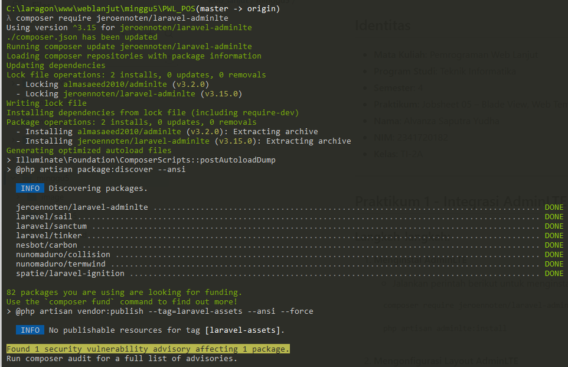
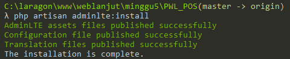
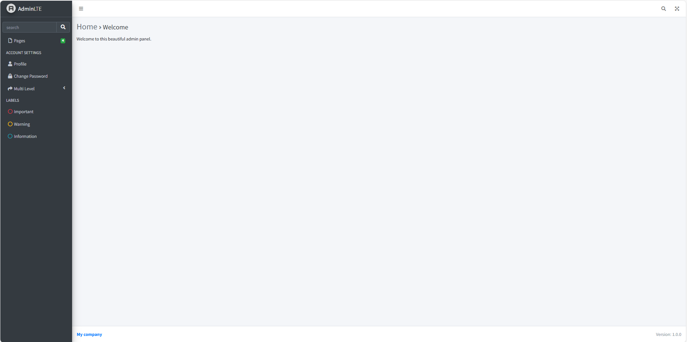

# Jobsheet-5: Blade View, Web Templating(AdminLTE), Datatables

- **Nama**: Fahmi Yahya
- **NIM**: 2341720089
- **Kelas**: TI-2A

## Praktikum 1 - Integrasi Laravel dengan AdminLte3

1. **Menginstal AdminLTE**
   ```bash
   composer require jeroennoten/laravel-adminlte
    ```
   

   ```bash
   php artisan adminlte:install
   ```
   

2. **Mengonfigurasi Layout AdminLTE**
   - Buat layout di path `resources/views/layouts/app.blade.php`
   <div style="max-height: 350px; overflow-y: auto;">

   ```php
   @extends('adminlte::page') 
 
   {{-- Extend and customize the browser title --}} 
   
   @section('title') 
      {{ config('adminlte.title') }} 
      @hasSection('subtitle') | @yield('subtitle') @endif 
   @stop 
   
   {{-- Extend and customize the page content header --}} 
   
   @section('content_header') 
      @hasSection('content_header_title') 
         <h1 class="text-muted"> 
               @yield('content_header_title') 
   
               @hasSection('content_header_subtitle') 
                  <small class="text-dark"> 
                     <i class="fas fa-xs fa-angle-right text-muted"></i> 
                     @yield('content_header_subtitle') 
                  </small> 
               @endif 
         </h1> 
      @endif 
   @stop 
   
   {{-- Rename section content to content_body --}} 
   
   @section('content') 
      @yield('content_body') 
   @stop 
   
   {{-- Create a common footer --}} 
   
   @section('footer') 
      <div class="float-right"> 
         Version: {{ config('app.version', '1.0.0') }} 
      </div> 
   
      <strong>
         <a href="{{ config('app.company_url', '#') }}"> 
               {{ config('app.company_name', 'My company') }} 
         </a> 
      </strong> 
   @stop 
   
   {{-- Add common Javascript/Jquery code --}} 
   
   @push('js') 
   <script> 
   
      $(document).ready(function() { 
         // Add your common script logic here... 
      }); 
   
   </script> 
   @endpush 
   
   {{-- Add common CSS customizations --}} 
   
   @push('css') 
   <style type="text/css"> 
   
      {{-- You can add AdminLTE customizations here --}} 
      /* 
      .card-header { 
         border-bottom: none; 
      } 
      .card-title { 
         font-weight: 600; 
      } 
      */ 
   </style> 
   @endpush
   ```

3. **Mengonfigurasi Halaman Welcome**
   - Sesuaikan di path `resources/views/welcome.blade.php`
   ```php
   @extends('layouts.app')

   {{-- Customize layout sections --}}
   @section('subtitle', 'Welcome')
   @section('content_header_title', 'Home')
   @section('content_header_subtitle', 'Welcome')

   {{-- Content body: main page content --}}
   @section('content_body')
      <p>Welcome to this beautiful admin panel.</p>
   @stop

   {{-- Push extra CSS --}}
   @push('css')
      {{-- Add here extra stylesheets --}}
      {{-- <link rel="stylesheet" href="/css/admin_custom.css"> --}}
   @endpush

   {{-- Push extra scripts --}}
   @push('js')
      <script> console.log("Hi, I'm using the Laravel-AdminLTE package!"); </script>
   @endpush
   ```
    
### Output:


