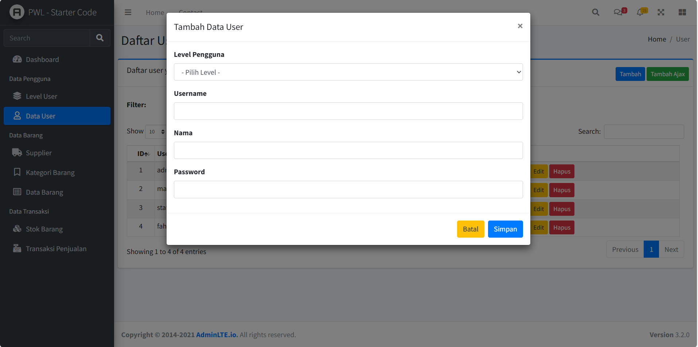
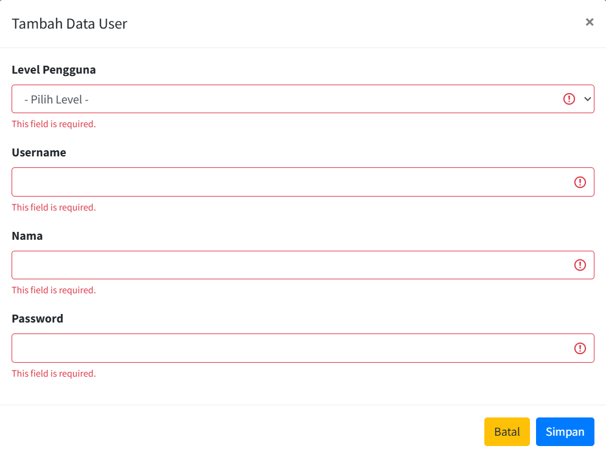
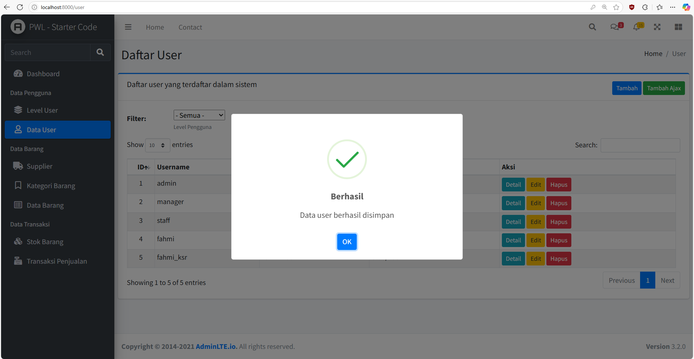
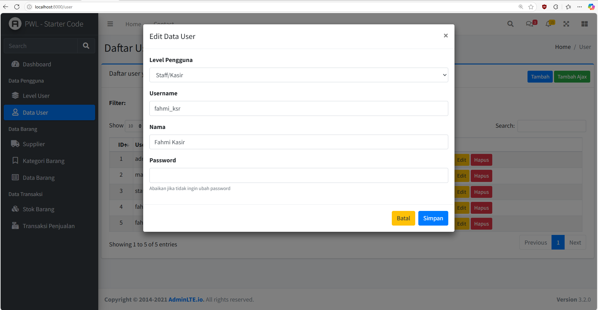
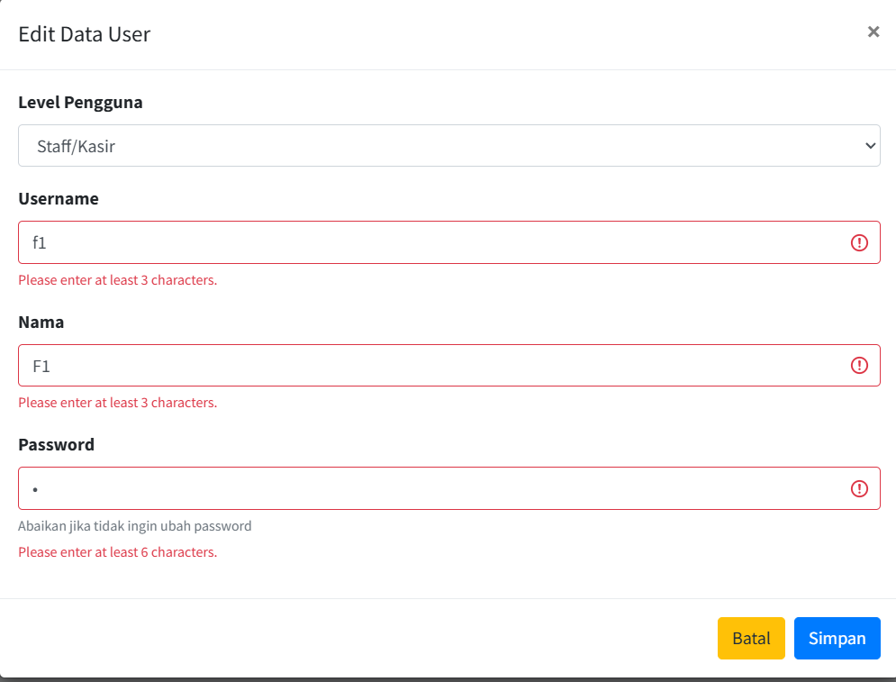
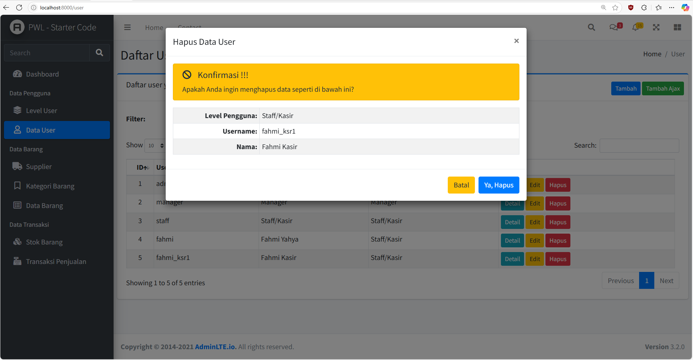

# Jobsheet-6: Ajax Form (AdminLTE) dan Client Validation
- **Nama**: Fahmi Yahya
- **NIM**: 2341720089
- **Kelas**: TI-2A

## Praktikum 1 - Modal Ajax Tambah Data (Data User)
   - **Tampilan form `Tambah Data User`**
   
  
   - **Validasi sisi client form `Tambah Data User`**
   
   
   - **Tampilan pesan berhasil `Tambah Data User`**
   

---

## Praktikum 2 - Modal Ajax Edit Data (Data User)
   - **Tampilan form `Edit Data User`**
   
  
   - **Validasi sisi client form `Edit Data User`**
   
   
   - **Tampilan pesan berhasil `Edit Data User`**
   

---

## Praktikum 3 - Modal Ajax Hapus Data (Data User)
   - **Tampilan modal konfirmasi `Delete Data User`**
   
  
   - **Tampilan pesan berhasil `Delete Data User`**
   