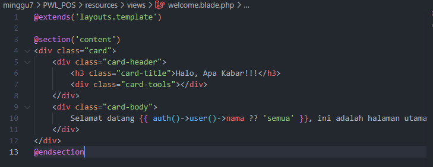

# Jobsheet-7: Authentication dan Authorization di Laravel
- **Nama**: Fahmi Yahya
- **NIM**: 2341720089
- **Kelas**: TI-2A

## Praktikum 1 - Implementasi Authentication
   1. **Memodifikasi `config/auth.php`**

   2. **Memodifikasi `UserModel.php`**

   3. **Membuat `AuthController.php`**

   4. **Membuat view `login.blade.php`**

   #### Output:
   

---

## Tugas 1 - Implementasi Authentication
   1. **Silahkan implementasikan proses login pada project kalian masing-masing**
   

   2. **Silahkan implementasi proses logout pada halaman web yang kalian buat**
   

   3. **Amati dan jelaskan tiap tahapan yang kalian kerjakan, dan jabarkan dalam laporan**
   - Mengambil nama dari session login di halaman utama.
   

   - Menyesuaikan bagian header untuk menambahkan aksi logout.
   

   4. **Submit kode untuk impementasi Authentication pada repository github kalian.**