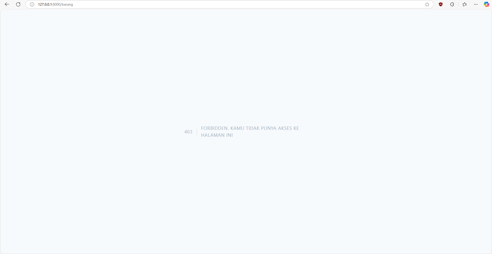

# Jobsheet-7: Authentication dan Authorization di Laravel
- **Nama**: Fahmi Yahya
- **NIM**: 2341720089
- **Kelas**: TI-2A

## Praktikum 1 - Implementasi Authentication
   

---

## Tugas 1 - Implementasi Authentication
   1. **Silahkan implementasikan proses login pada project kalian masing-masing**
   

   2. **Silahkan implementasi proses logout pada halaman web yang kalian buat**
      - Menyesuaikan bagian header untuk menambahkan aksi logout.
      

         #### Output:
         

   3. **Amati dan jelaskan tiap tahapan yang kalian kerjakan, dan jabarkan dalam laporan**
      - Sesuai dengan langkah-langkah di jobsheet, yakni:
         1. **Memodifikasi `config/auth.php`**

         2. **Memodifikasi `UserModel.php`**

         3. **Membuat `AuthController.php`**

         4. **Membuat view `login.blade.php`**

         5. **Menambahkan route ke `web.php`**

   4. **Submit kode untuk impementasi Authentication pada repository github kalian.**

---

## Praktikum 2 - Implementasi Authorizaton di Laravel dengan Middleware
   - **Login Menggunakan Admin**
   
   - **Login Menggunakan Manager**
   

---

## Tugas 2 - Implementasi Authorization
   1. **Apa yang kalian pahami pada praktikum 2 ini?**
      - Authorization atau Hak Akses setiap role dapat diatur menggunakan Middleware.
   2. **Amati dan jelaskan tiap tahapan yang kalian kerjakan, dan jabarkan dalam laporan**
      - Sesuai dengan langkah-langkah di jobsheet, yakni:
      1. **Memodifikasi `UserModel.php`**

      2. **Membuat `AuthorizeUser.php`**

      3. **Menambahkan alias middleware di `Kernel.php`**

      4. **Memodifikasi route di `web.php`**
   3. **Submit kode untuk impementasi Authorization pada repository github kalian.**

---

## Praktikum 3 - Implementasi Multi-Level Authorizaton di Laravel dengan Middleware
   - **Menggunakan level user Admin**
   
   - **Menggunakan level user Manager**
   
   - **Menggunakan level user Staff/Kasir**
   
   - **Menggunakan level user Pelanggan**
   

---

## Tugas 3 - Implementasi Multi-Level Authorization
   1. **Silahkan implementasikan multi-level authorization pada project kalian masing-masing**
   2. **Amati dan jelaskan tiap tahapan yang kalian kerjakan, dan jabarkan dalam laporan**
      - Sesuai dengan langkah-langkah di jobsheet, yakni:
         1. **Memodifikasi `UserModel.php`**

         2. **Memodifikasi `AuthorizeUser.php`**

         3. **Memodifikasi route di `web.php`**
   3. **Implementasikan multi-level authorization untuk semua Level/Jenis User dan Menu menu yang sesuai dengan Level/Jenis User**
      - Role Admin: Semua Fitur
      - Role Manager: Supplier, Kategori Barang, Barang
      - Role Staff/Kasir: Barang
      
   4. **Submit kode untuk impementasi Authorization pada repository github kalian.**