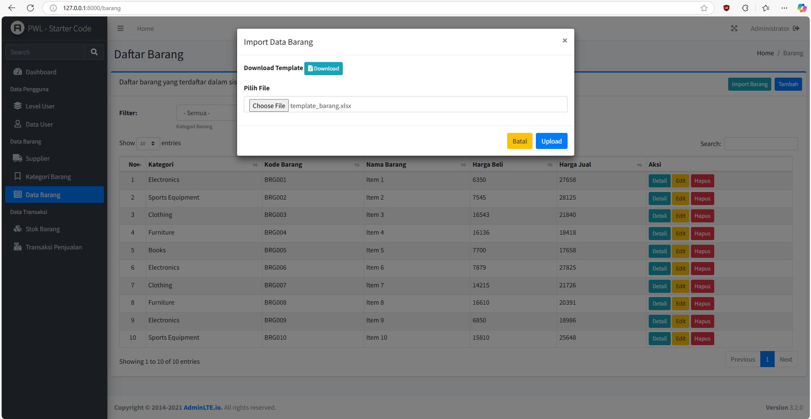
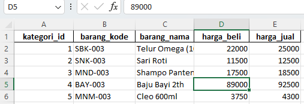
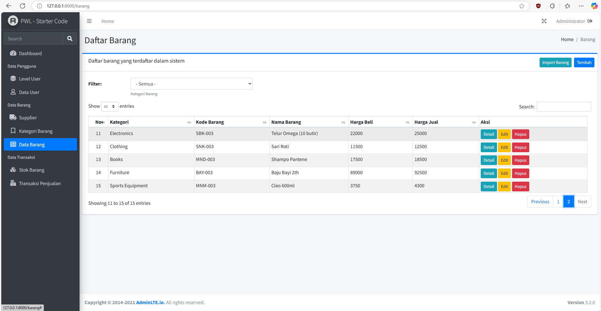
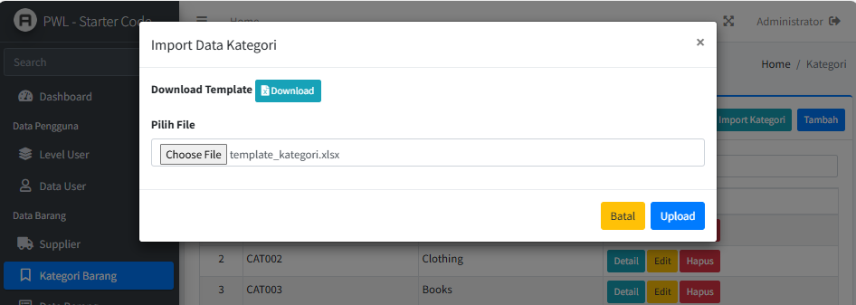
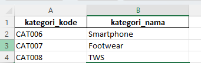
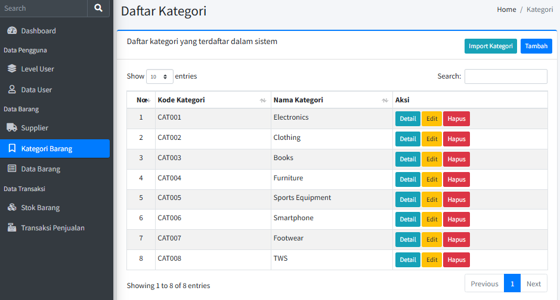
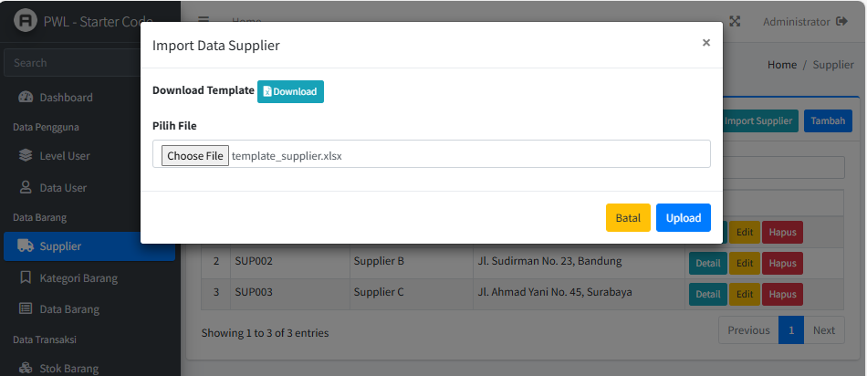
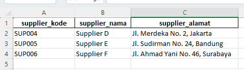
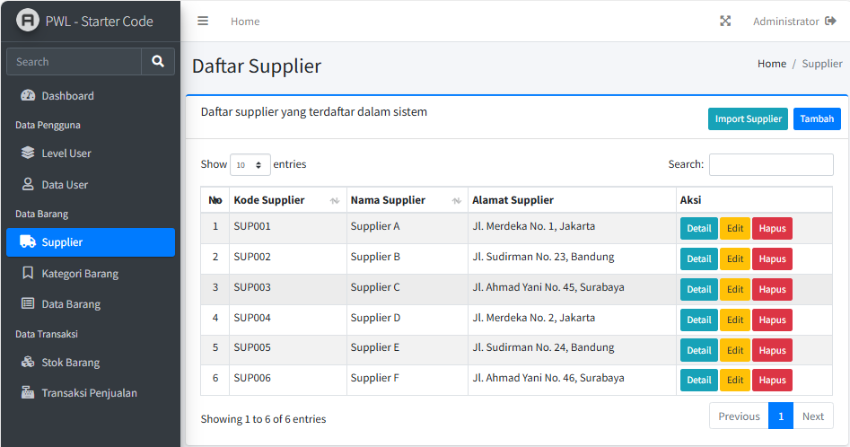

# Jobsheet-8: File Import dan Export ke PDF dan Excel pada Laravel
- **Nama**: Fahmi Yahya
- **NIM**: 2341720089
- **Kelas**: TI-2A

## Praktikum 1 - Implementasi Upload File untuk import data
   - Form Import

        
   - Isi File Import

        
   - Hasil Import

        

---

## Tugas 1 - Implementasi File Upload untuk Import Data
   1. **Silahkan implementasikan praktikum 1 pada project kalian masing-masing untuk semua menu**
        1. Data Kategori
            - Form Import

                
            - Isi File Import

                
            - Hasil Import

                
        2. Data Barang
            - Form Import
            
                
            - Isi File Import
            
                
            - Hasil Import
            
                
        3. Data Supplier
            - Form Import
            
                
            - Isi File Import
            
                
            - Hasil Import
            
                

   2. **Amati dan jelaskan tiap tahapan yang kalian kerjakan, dan jabarkan dalam laporan**
      - Identik dengan langkah-langkah di praktikum 1, yakni:
         1. **Membuat template di excel**

         2. **Menambahkan tombol import data**

         3. **Membuat file view modal**
         
         4. **Memodifikasi  controller untuk view modal dan submit file**

         5. **Menambahkan route ke `web.php`**

   4. **Submit kode untuk impementasi prakktikum 1 pada repository github kalian**
