# Jobsheet-8: File Import dan Export ke PDF dan Excel pada Laravel
- **Nama**: Fahmi Yahya
- **NIM**: 2341720089
- **Kelas**: TI-2A

## Praktikum 1 - Implementasi Upload File untuk import data
   - Form Import

        
   - Isi File Import

        
   - Hasil Import

        

---

## Tugas 1 - Implementasi File Upload untuk Import Data
   1. **Silahkan implementasikan praktikum 1 pada project kalian masing-masing untuk semua menu**
        1. Data Kategori
            - Form Import

                
            - Isi File Import

                
            - Hasil Import

                
        2. Data Barang
            - Form Import
            
                
            - Isi File Import
            
                
            - Hasil Import
            
                
        3. Data Supplier
            - Form Import
            
                
            - Isi File Import
            
                
            - Hasil Import
            
                

   2. **Amati dan jelaskan tiap tahapan yang kalian kerjakan, dan jabarkan dalam laporan**
      - Identik dengan langkah-langkah di praktikum 1, yakni:
         1. **Membuat template di excel**

         2. **Menambahkan tombol import data**

         3. **Membuat file view modal**
         
         4. **Memodifikasi  controller untuk view modal dan submit file**

         5. **Menambahkan route ke `web.php`**

   4. **Submit kode untuk impementasi prakktikum 1 pada repository github kalian**

---

## Praktikum 2 - Export Data ke Excel
   - Data Index
        
        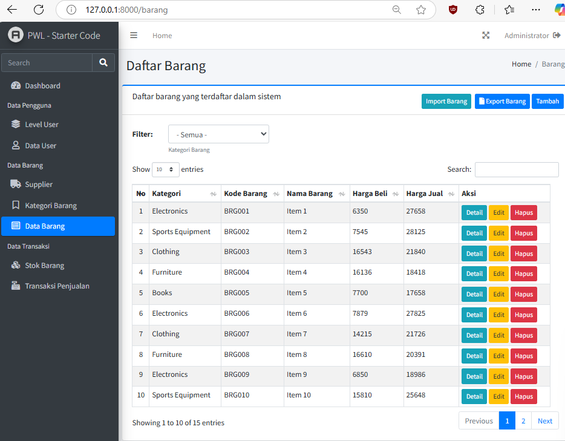
   - Isi File Export
        
        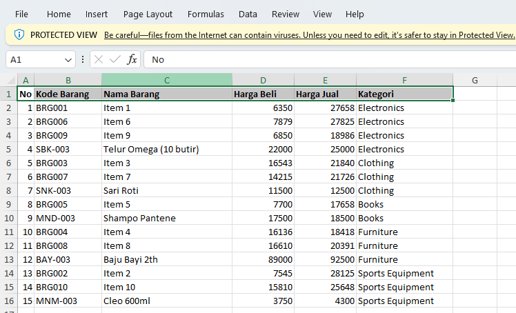

---

## Tugas 2 - Implementasi File Export Excel
   1. **Silahkan implementasikan praktikum 2 pada project kalian masing-masing untuk semua menu**
        1. Data Kategori
            - Data Index

                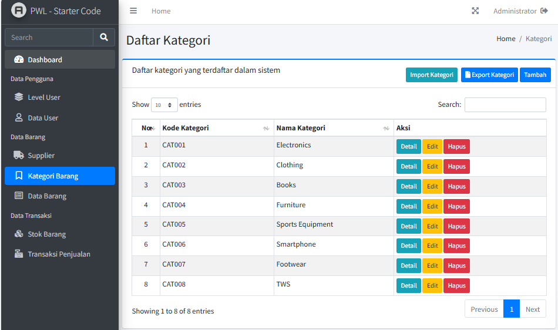
            - Isi File Export

                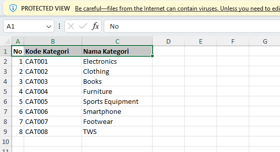
        2. Data Barang
            - Data Index
            
                
            - Isi File Export
            
                
        3. Data Supplier
            - Data Index
            
                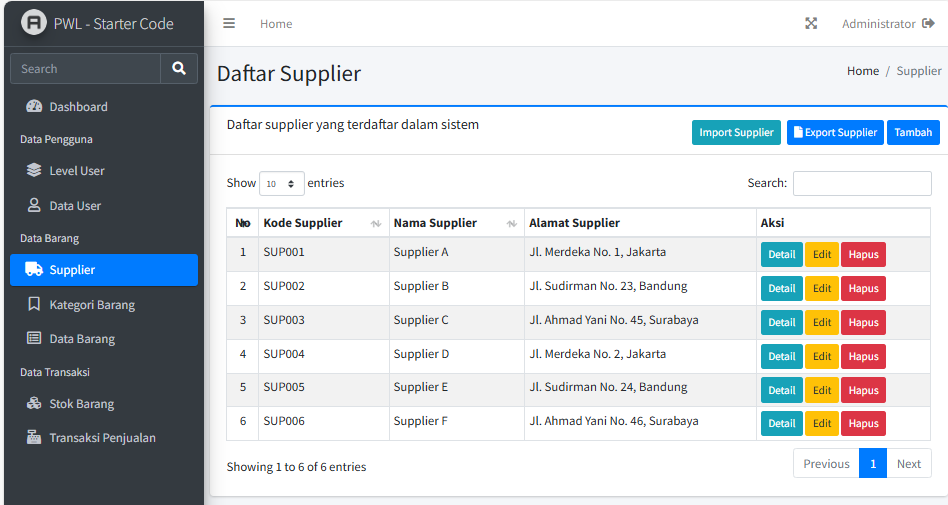
            - Isi File Export
            
                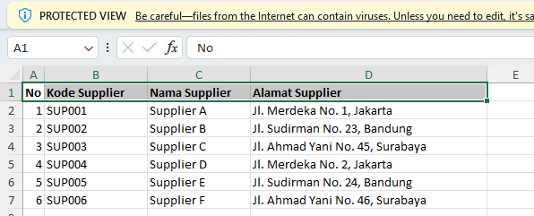
   2. **Amati dan jelaskan tiap tahapan yang kalian kerjakan, dan jabarkan dalam laporan**
      - Identik dengan langkah-langkah di praktikum 2, yakni:
         1. **Menambahkan tombol export data**

         2. **Memodifikasi controller untuk menambahkan fungsi export_excel()**

         3. **Menambahkan route ke `web.php`**
   3. **Submit kode untuk impementasi prakktikum 2 pada repository github kalian**

---

## Praktikum 3 - Implementasi Export PDF di Laravel dengan dompdf
   - Data Index
        
        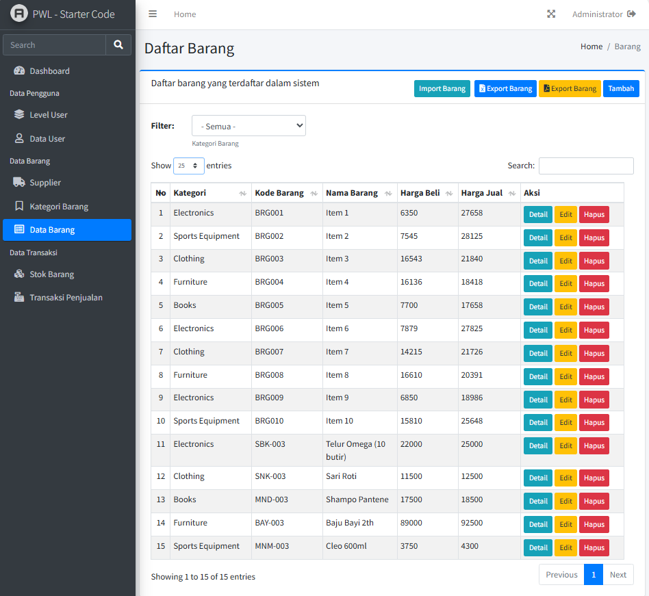
   - Isi File Export
        
        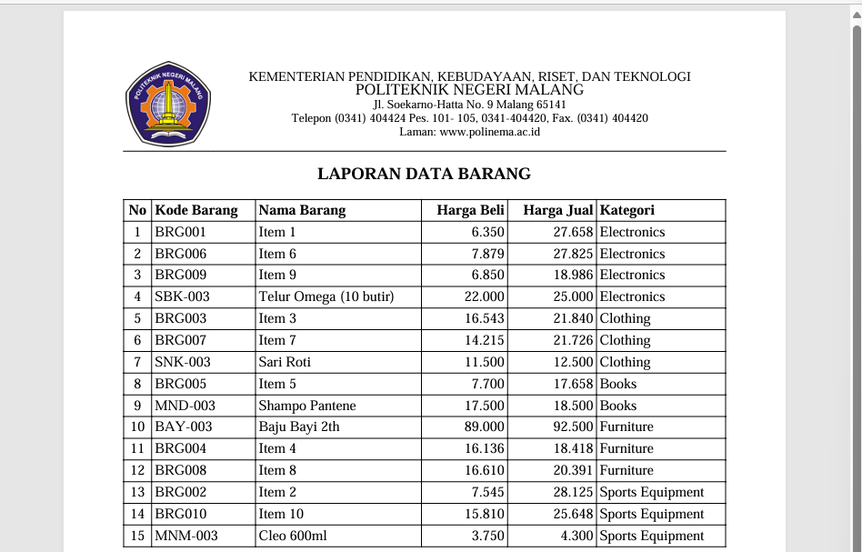

---

## Tugas 3 - Implementasi Export PDF pada Laravel
   1. **Silahkan implementasikan export pdf pada project kalian masing-masing untuk semua menu**
        1. Data Kategori
            - Data Index

                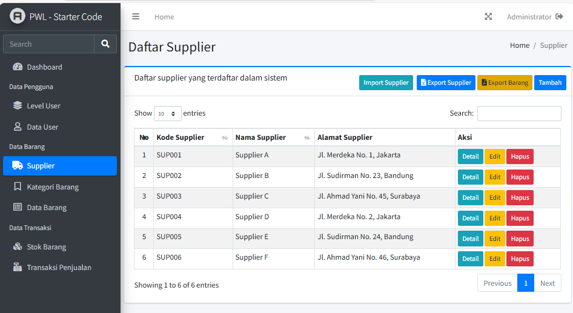
            - Isi File Export

                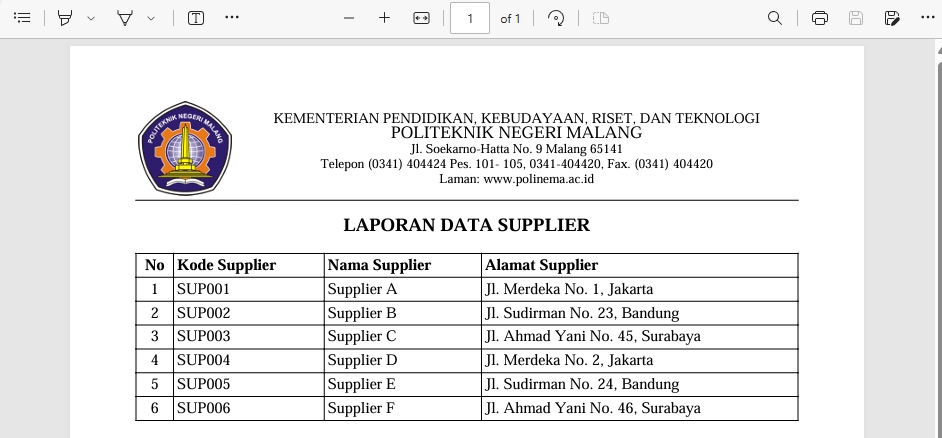
        2. Data Barang
            - Data Index
            
                
            - Isi File Export
            
                
        3. Data Supplier
            - Data Index
            
                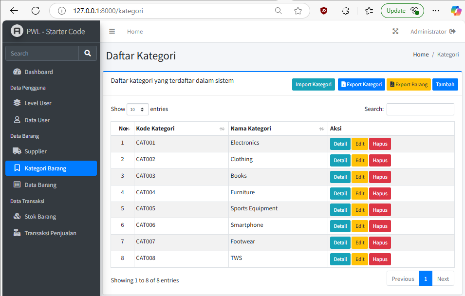
            - Isi File Export
            
                
   2. **Amati dan jelaskan tiap tahapan yang kalian kerjakan, dan jabarkan dalam laporan**
      - Identik dengan langkah-langkah di praktikum 3, yakni:
         1. **Menambahkan tombol export data pdf**

         2. **Memodifikasi controller untuk menambahkan fungsi export_pdf()**

         3. **Menambahkan route ke `web.php`**
   3. **Submit kode untuk impementasi export pdf pada repository github kalian**

## Tugas 4 - Implementasi Upload File Gambar
   1. **Silahkan implementasikan fitur upload file untuk mengubah foto profile di project web kalian**
        - Tambah User
        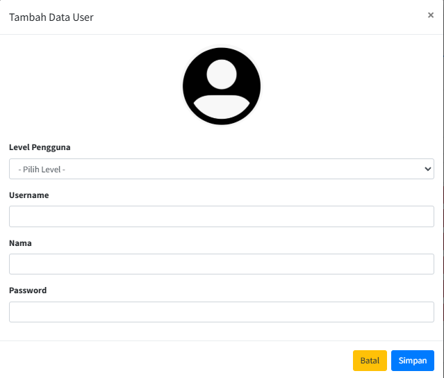
        - Edit User
        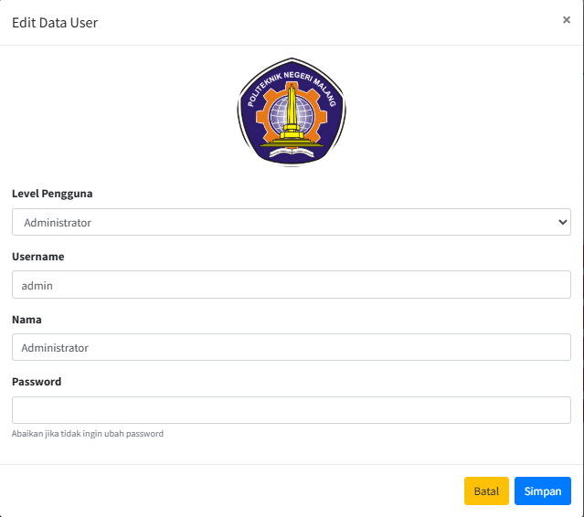
        - Detail User
        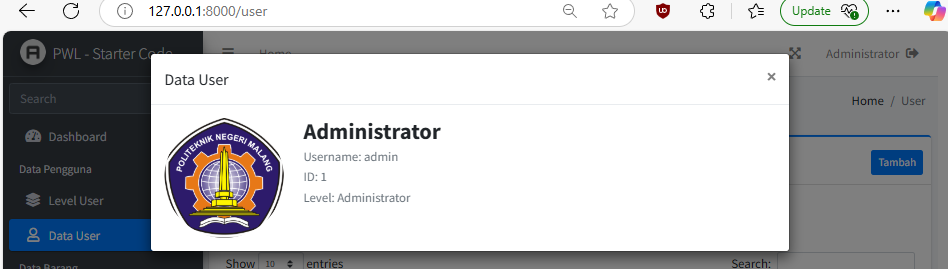
        - Hapus User
        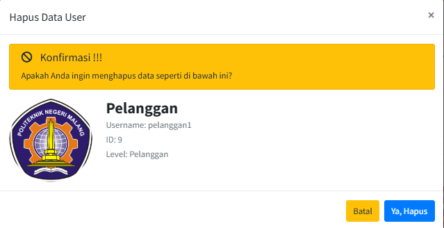

   2. **Amati dan jelaskan tiap tahapan yang kalian kerjakan, dan jabarkan dalam laporan**
         1. **Membuat migrasi untuk menambahkan kolom `picture_path`**

         2. **Menambahkan `picture_path` di variable fillable pada UserModel.php**

         3. **Memodifikasi form user untuk upload, edit, detail, dan hapus tampilan foto profil**

         4. **Memodifikasi fungsi `store_ajax()` dan `update_ajax()` UserController.php**
   3. **Submit kode untuk impementasi upload file gambar pada repository github kalian**