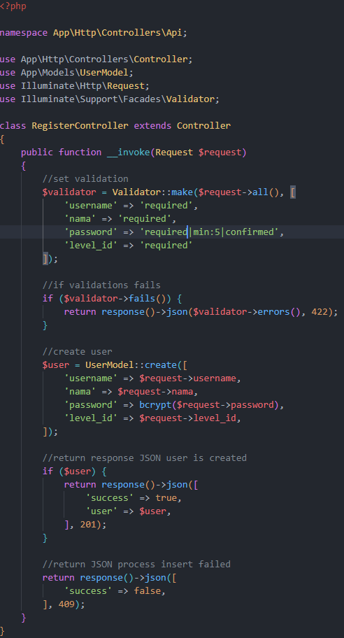

# Jobsheet-10: RESTFUL API
- **Nama**: Fahmi Yahya
- **NIM**: 2341720089
- **Kelas**: TI-2A

## Praktikum 1 - Membuat RESTful API Register
1. **Instalasi aplikasi postman**
    
    
2. **Instalasi JWT**
    ```
    composer require tymon/jwt-auth:2.1.1
    ```
    
    
3. **Membuat secret konfigurasi**
    ```
    php artisan jwt:secret
    ```
    
    
4. **Publish secret key**
    ```
     php artisan vendor:publish --provider="Tymon\JWTAuth\Providers\LaravelServiceProvider"
    ```
    
    
5. **Memodifikasi `config/auth.php`**
    
    
6. **Menambah kode di `UserModel.php`**
    
    
7. **Membuat controller di `controller/Api/RegisterController`**
    
    
8. **Menambahkan route register di `routes/api.php`**
    
    
9. **Hasil**
    - Data Tidak Valid
        
        
    - Data Valid
        
        