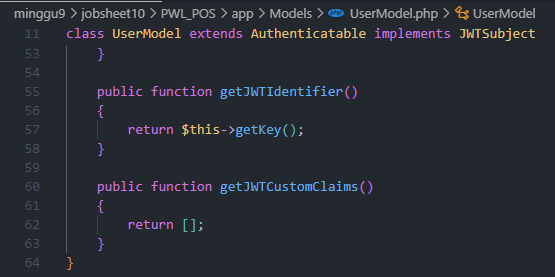

# Jobsheet-10: RESTFUL API
- **Nama**: Fahmi Yahya
- **NIM**: 2341720089
- **Kelas**: TI-2A

## Praktikum 1 - Membuat RESTful API Register
1. **Instalasi aplikasi postman**
    
    
2. **Instalasi JWT**
    ```
    composer require tymon/jwt-auth:2.1.1
    ```
    
    
3. **Membuat secret konfigurasi**
    ```
    php artisan jwt:secret
    ```
    
    
4. **Publish secret key**
    ```
     php artisan vendor:publish --provider="Tymon\JWTAuth\Providers\LaravelServiceProvider"
    ```
    
    
5. **Memodifikasi `config/auth.php`**
    
    
6. **Menambah kode di `UserModel.php`**
    
    
7. **Membuat controller di `controller/Api/RegisterController`**
    
    
8. **Menambahkan route register di `routes/api.php`**
    
    
9. **Hasil**
    - Data Tidak Valid
        
        
    - Data Valid
        
        

---

## Praktikum 2 - Membuat RESTful API Login
1. **Membuat controller di `controller/Api/LoginController`**

    
2. **Menambahkan route register di `routes/api.php`**
    
    
3. **Hasil**
    - Data Kosong
        
        
    - Sukses
        
        
    - Username atau Password Salah
        
        

---

## Praktikum 3 - Membuat RESTful API Logout
1. **Membuat controller di `controller/Api/LogoutController`**

    
2. **Menambahkan route register di `routes/api.php`**
    
    
3. **Hasil**
        
    

---

## Praktikum 4 - Implementasi CRUD dalam RESTful API
1. **Membuat controller di `controller/Api/LevelController`**

    
2. **Menambahkan route register di `routes/api.php`**
    
    
3. **Hasil**
    - List Data
        
        
    - Create Data
        
        
    - Get Data by ID (level_id=6)
        
        
    - Edit Data level_kode by ID (level_id=6)
        
        
    - Delete Data by ID (level_id=6)
        
        

---

## Tugas - Implementasi Tabel Lain
1. **Tabel `m_user`**

    
2. **Tabel `m_kategori`**
    
    
3. **Tabel `m_barang`**
        
    