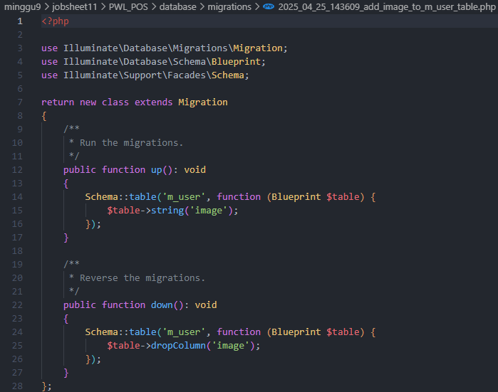
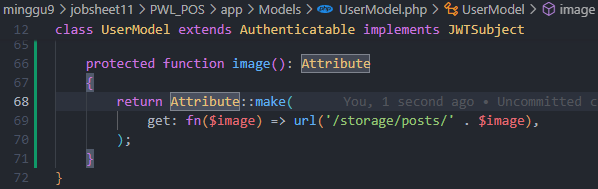
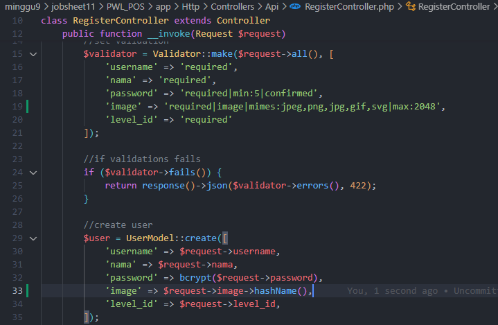
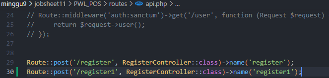
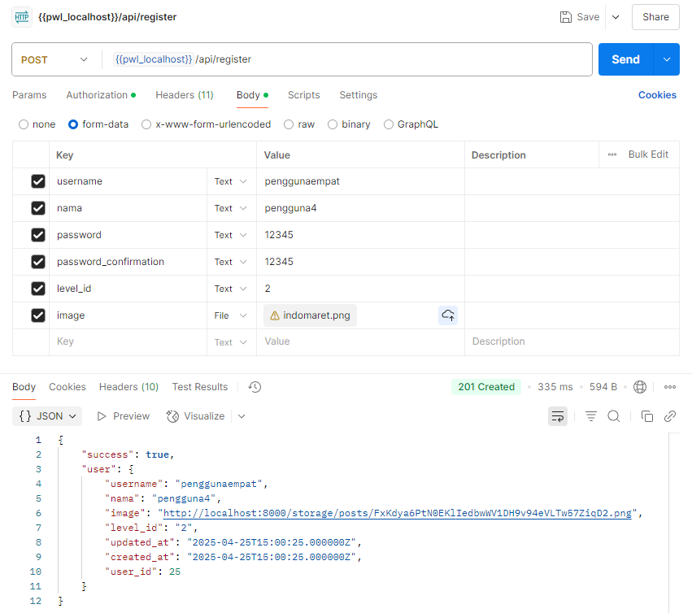

# Jobsheet-11: RESTFUL API 2
- **Nama**: Fahmi Yahya
- **NIM**: 2341720089
- **Kelas**: TI-2A

## Praktikum 1 -  Implementasi Eloquent Accessor
1. **Menambahkan kolom image pada tabel `m_user`**
    ```
    php artisan make:migration add_image_to_m_user_table
    ```

    

2. **Modifikasi model `App/Models/UserModel.php`**

    

3. **Modifikasi controller `App/Controller/Api/RegisterController`**

    

4. **Menambahkan route register1 di `routes/api.php`**

    

5. **Hasil**

    